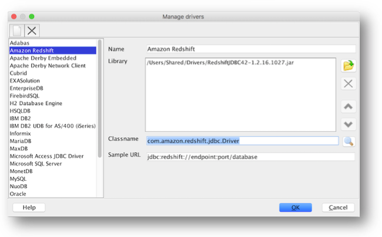
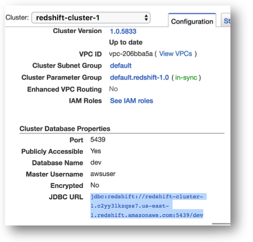
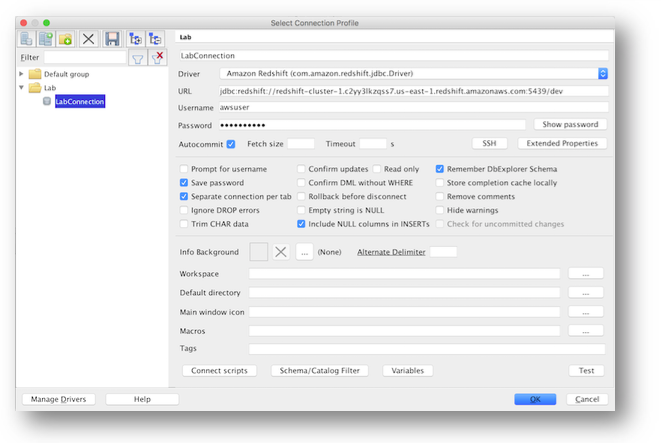
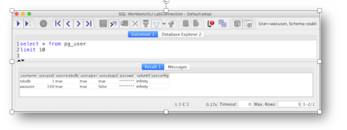

# LAB 1 - Setup JDBC connectivity
In this lab you will install JDBC tool and setup connectivity .

## Contents
* [Download and Install Client Tool](#Download-and-Install-Client-Tool)
* [Configure Client Tool](#configure-client-tool)
* [Run Sample Query](#run-sample-query)


## Download and Install Client Tool
* While Amazon Redshift does provide a web-based [Query editor](https://console.aws.amazon.com/redshift/home?#query:) for executing simple queries which complete in under 3 minutes, for these labs, it is recommended you install a third-party tool.We will use SQL Workbench/J

* Download and install from link --> [SQL Workbench/J](http://www.sql-workbench.eu/downloads.html). Select "Generic package for all systems including all optional libraries"

* Once you have installed your third-party tool, you will need either a JDBC or ODBC driver.  Amazon Redshift offers JDBC and ODBC drivers for download. In this exercise we will JDBC driver that can be downloaded from [RedShift JDBC Documentation] (https://s3.amazonaws.com/redshift-downloads/drivers/jdbc/1.2.34.1058/RedshiftJDBC42-no-awssdk-1.2.34.1058.jar)


## Configure Client Tool

* Launch SQL Workbench/J and navigate to [File | Manage Drivers].
* Select "Amazon Redshift" and set the driver Library location to where you downloaded the Redshift JDBC Driver. Click Ok.

* Navigate to [File | Connect Window] to create a new connection profile and modify the following settings and once complete click on the "Test Connection" button.
  * Name - "LabConnection"
  * Driver - Amazon Redshift (com.amazon.redshift.jdbc.Driver)
  * URL - Find this by navigating to the [Cluster List](https://console.aws.amazon.com/redshift/home?cluster-details:#cluster-list:), selecting your cluster, and copying the JDBC URL.  
  
  * Username - [Master user name] -- provided separately
  * Password - [Master user password]  -- provided separately
  * Autocommit - Enabled
  


## Run Sample Query
* Run the following query to list the users within the redshift cluster.  
```
select * from pg_user
```
* If you receive the following results, you have established connectivity and this lab is complete.  

