# Lab 4 - Modernize Your Data Warehouse with Amazon Redshift Spectrum

In this lab, we show you how to query petabytes of data with Amazon Redshift and exabytes of data in your Amazon S3 data lake, without loading or moving objects. We will also demonstrate how you can leverage views which union data in direct attached storage as well as in your S3 Datalake to create a single source of truth.  Finally, we will demonstrate strategies for aging off old data into S3 and maintaining only the most recent data in Amazon Redshift direct attached storage.

## Contents
* [Before You Begin](#before-you-begin)
* [Go Back In Time](#go-back-in-time)
* [Create a Single Version of Truth](#create-a-single-version-of-truth)
* [Plan for the Future](#plan-for-the-future)

## Before You Begin
It assumes you have access to a configured client tool. For more details on configuring SQL Workbench/J as your client tool, see [Lab 1 - Creating Redshift Clusters : Configure Client Tool](../lab1/README.md#configure-client-tool). As an alternative you can use the Redshift provided online Query Editor which does not require an installation.
```
https://console.aws.amazon.com/redshift/home?#query:
```

In the first part of this lab, we will perform the following activities:
* Load the Green company data for January 2016 into Redshift direct-attached storage (DAS) with COPY.
* The CSV data is by month on Amazon S3. Here's a quick screenshot from the S3 console:
````
https://s3.console.aws.amazon.com/s3/buckets/us-west-2.serverless-analytics/NYC-Pub/green/?region=us-west-2&tab=overview&prefixSearch=green_tripdata_2016
````
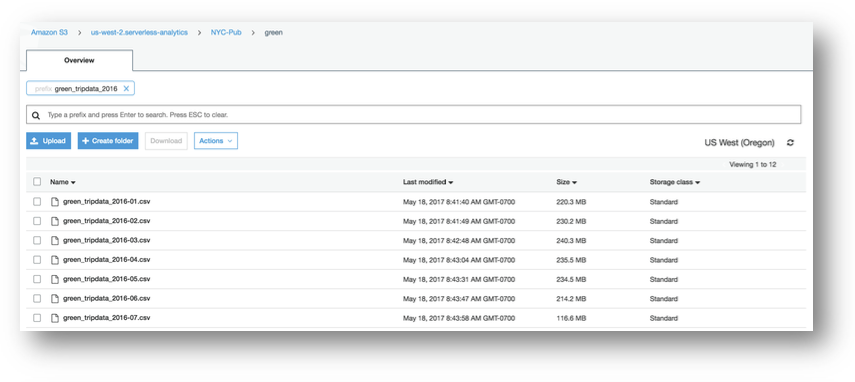

* Here's Sample data from one file which can be previewed directly in the S3 console:
````
https://s3.console.aws.amazon.com/s3/object/us-west-2.serverless-analytics/NYC-Pub/green/green_tripdata_2013-08.csv?region=us-west-2&tab=select
````
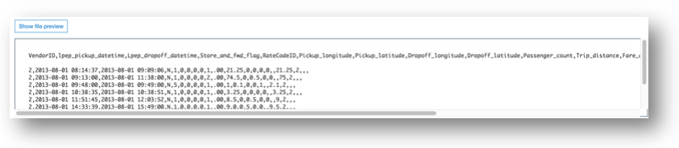


### Build your DDL
Create a schema `workshop_das` and table `workshop_das.green_201601_csv` for tables that will reside on the Redshift compute nodes, AKA the Redshift direct-attached storage (DAS) tables.

````
CREATE SCHEMA workshop_das;

CREATE TABLE workshop_das.green_201601_csv
(
  vendorid                VARCHAR(4),
  pickup_datetime         TIMESTAMP,
  dropoff_datetime        TIMESTAMP,
  store_and_fwd_flag      VARCHAR(1),
  ratecode                INT,
  pickup_longitude        FLOAT4,
  pickup_latitude         FLOAT4,
  dropoff_longitude       FLOAT4,
  dropoff_latitude        FLOAT4,
  passenger_count         INT,
  trip_distance           FLOAT4,
  fare_amount             FLOAT4,
  extra                   FLOAT4,
  mta_tax                 FLOAT4,
  tip_amount              FLOAT4,
  tolls_amount            FLOAT4,
  ehail_fee               FLOAT4,
  improvement_surcharge   FLOAT4,
  total_amount            FLOAT4,
  payment_type            VARCHAR(4),
  trip_type               VARCHAR(4)
)
DISTSTYLE EVEN
SORTKEY (passenger_count,pickup_datetime);
````

### Build your Copy Command
* Build your copy command to copy the data from Amazon S3. This dataset has the number of taxi rides in the month of January 2016.

````
COPY workshop_das.green_201601_csv
FROM 's3://us-west-2.serverless-analytics/NYC-Pub/green/green_tripdata_2016-01.csv'
IAM_ROLE '[Your-Redshift_Role-ARN]'
DATEFORMAT 'auto'
IGNOREHEADER 1
DELIMITER ','
IGNOREBLANKLINES
;
````

## Go Back in Time
In the next part of this lab, we will perform the following activities:
* Query historical data residing on S3 by create an external DB for Redshift Spectrum.
* Introspect the historical data, perhaps rolling-up the data in novel ways to see trends over time, or other dimensions.


**Note the partitioning scheme is Year, Month, Type (where Type is a taxi company). Here's a quick Screenshot:**

````
https://s3.console.aws.amazon.com/s3/buckets/serverless-analytics/canonical/NY-Pub/?region=us-east-1&tab=overview
````
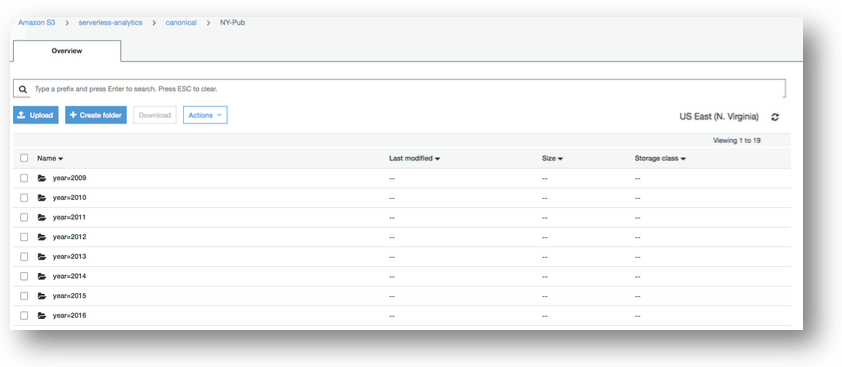
````
https://s3.console.aws.amazon.com/s3/buckets/serverless-analytics/canonical/NY-Pub/year%253D2016/month%253D1/?region=us-east-1&tab=overview
````
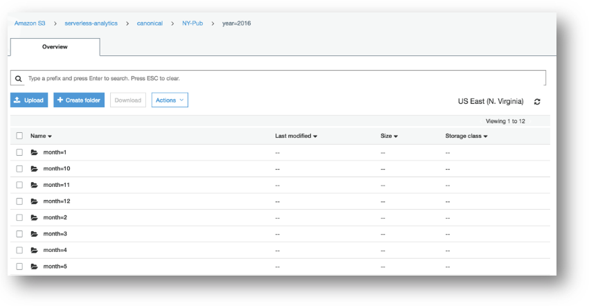
````
https://s3.console.aws.amazon.com/s3/buckets/serverless-analytics/canonical/NY-Pub/year%253D2016/month%253D1/type%253Dgreen/?region=us-east-1&tab=overview
````
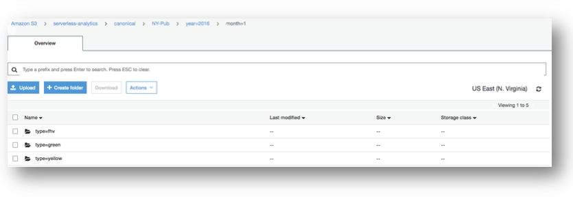


### Create external schema (and DB) for Redshift Spectrum
Because external tables are stored in a shared Glue Catalog for use within the AWS ecosystem, they can be built and maintained using a few different tools, e.g. Athena, Redshift, and Glue.

* Use the AWS Glue Crawler to create your external table adb305.ny_pub stored in parquet format under location s3://us-west-2.serverless-analytics/canonical/NY-Pub/.

	1. Navigate to the **Glue Crawler Page**. https://console.aws.amazon.com/glue/home?#catalog:tab=crawlers
	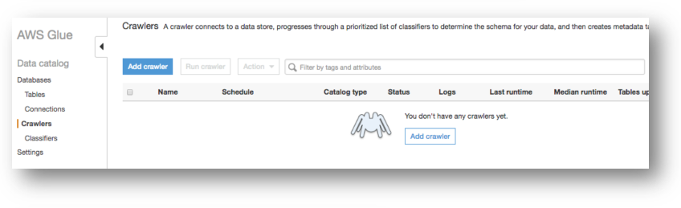
	1. Click on *Add Crawler*, and enter the crawler name *NYTaxiCrawler* and click *Next*.
	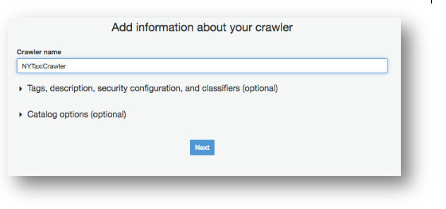
	1. Select *Data stores* as the source type and click *Next*.
	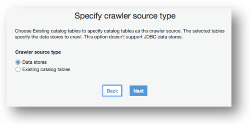
	1. Choose *S3* as the data store and the include path of *s3://us-west-2.serverless-analytics/canonical/NY-Pub*
	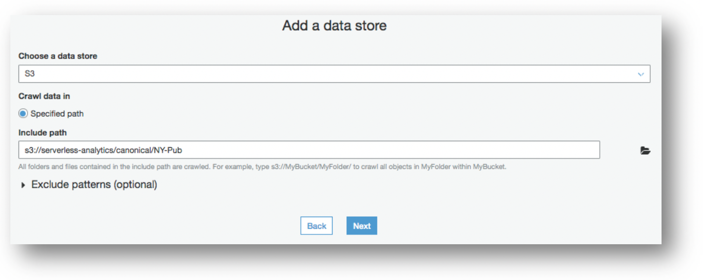
	1. *Choose an existing IAM Role* and select the name mod-*-GlueCrawlerRole-*.  
	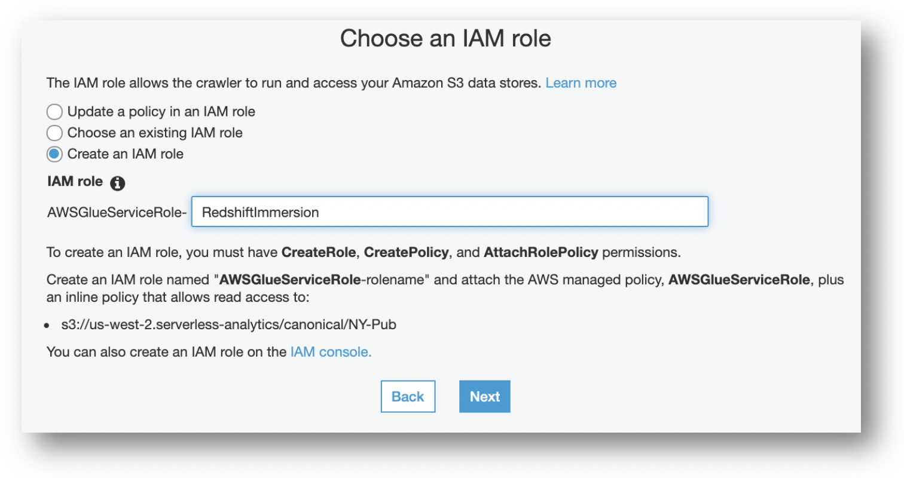
	1. Select *Run on demand* for the frequency.
	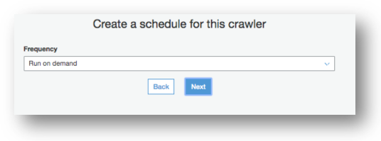
	1. Click on *Add database* and enter the Database of *spectrumdb*
	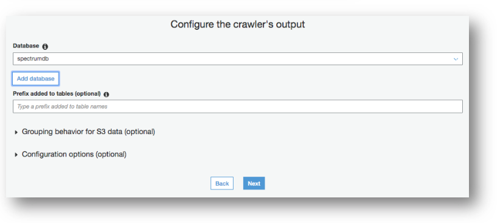
	1. Select all remaining defaults. Once the Crawler has been created, click on *Run Crawler*.
	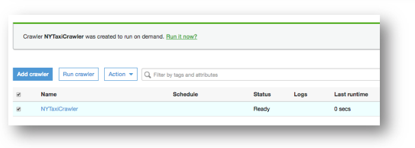
	1. Once the Crawler has completed its run (approximate runtime - 3 mins), you will see a new table in the Glue Catalog. https://console.aws.amazon.com/glue/home?#catalog:tab=tables
	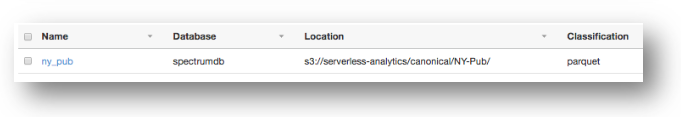
	1. Click on the *ny_pub* table, notice the recordCount of 2.87 billion.
	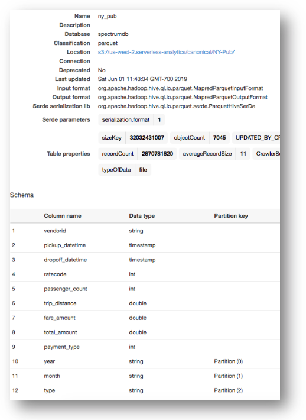


* Now that the table has been cataloged, switch back to your Redshift query editor and create an external schema **adb305** pointing to your Glue Catalog Database **spectrumdb**


```
CREATE external SCHEMA adb305
FROM data catalog DATABASE 'spectrumdb'
IAM_ROLE '[Your-Redshift-Role-ARN]'
CREATE external DATABASE if not exists;
```

* Run the query from the previous step using the external table instead of the direct-attached storage (DAS).

```
SELECT TO_CHAR(pickup_datetime, 'YYYY-MM-DD'),
COUNT(*)
FROM adb305.ny_pub
WHERE YEAR = 2016 and Month = 01
GROUP BY 1
ORDER BY 1;
```

## Create a Single Version of Truth
In the next part of this lab, we will demonstrate how to create a view which has data that is consolidated from S3 via Spectrum and the Redshift direct-attached storage.

### Create a view
Create a view that covers both the January, 2016 Green company DAS table with the historical data residing on S3 to make a single table exclusively for the Green data scientists. Use CTAS to create a table with data from January, 2016 for the Green company. Compare the runtime to populate this with the COPY runtime earlier.

CTAS approximate runtime is 11.40s
COPY approximate runtime is 9.67s

With CTAS method, we have more flexibility to transform data while loading in local Redshift table.


```
CREATE TABLE workshop_das.taxi_201601 AS
SELECT * FROM adb305.ny_pub
WHERE year = 2016 AND month = 1 AND type = 'green';
```


Note: What about column compression/encoding? Similar to COPY command, remember that on a CTAS, Amazon Redshift automatically assigns compression encoding as follows:

* Columns that are defined as sort keys are assigned RAW compression.
* Columns that are defined as BOOLEAN, REAL, or DOUBLE PRECISION data types are assigned RAW compression.
* All other columns are assigned LZO compression.


https://docs.aws.amazon.com/redshift/latest/dg/r_CTAS_usage_notes.html

### Complete populating the table
Add to the January, 2016 table with an INSERT/SELECT statement for the other taxi companies.

```
INSERT INTO workshop_das.taxi_201601 (
  SELECT *
  FROM adb305.ny_pub
  WHERE year = 2016 AND month = 1 AND type != 'green');
```

### Remove overlaps in the Spectrum table
Now that we've loaded all January, 2016 data, we can remove the partitions from the Spectrum table so there is no overlap between the direct-attached storage (DAS) table and the Spectrum table.


```
ALTER TABLE adb305.ny_pub DROP PARTITION(year=2016, month=1, type='fhv');
ALTER TABLE adb305.ny_pub DROP PARTITION(year=2016, month=1, type='green');
ALTER TABLE adb305.ny_pub DROP PARTITION(year=2016, month=1, type='yellow');
```

### Create a view with no Schema Binding
Create a view **adb305_view_NYTaxiRides** from **workshop_das.taxi_201601** that allows seamless querying of the DAS and Spectrum data.


```
CREATE VIEW adb305_view_NYTaxiRides AS
  SELECT * FROM workshop_das.taxi_201601
  UNION ALL
  SELECT * FROM adb305.ny_pub
WITH NO SCHEMA BINDING;

```
### View results together

* Note the use of the partition columns in the SELECT and WHERE clauses. Where were those columns in your Spectrum table definition?
* Note the filters being applied either at the partition or file levels in the Spectrum portion of the query (versus the Redshift DAS section).
* If you actually run the query (and not just generate the explain plan), does the runtime surprise you? Why or why not?


* Analyze Redshift local data (month 201601) with Spectrum data (rest of data). Also, since Spectrum is priced based on data scanned, second query looks at amount of data scanned by first query and associated cost

````
SELECT year, month, type, COUNT(*)
FROM adb305_view_NYTaxiRides
WHERE year = 2016 AND passenger_count = 4
GROUP BY 1,2,3 ORDER BY 1,2,3;

````
````
select qm.query, query_blocks_read,query_execution_time,scan_row_count,spectrum_scan_row_count,spectrum_scan_size_mb,cast(cast(spectrum_scan_size_mb as float)/1024/1024*5.000  as varchar) spectrum_cost ,TRIM(querytxt) as SQL,qr.starttime,qr.endtime
from SVL_QUERY_METRICS_SUMMARY qm join STL_QUERY qr
on qm.query=qr.query
order by qr.endtime desc;
````

## Plan for the Future
In this final part of this lab, we will compare different strategies for maintaining more recent or *HOT* data within Redshift direct-attached storage, and keeping older *COLD* data in S3 by performing the following steps:
* Allow for trailing 5 quarters reporting by adding the Q4 2015 data to Redshift DAS:
	* Anticipating that we’ll want to ”age-off” the oldest quarter on a 3 month basis, architect your DAS table to make this easy to maintain and query.
	* Adjust your Redshift Spectrum table to exclude the Q4 2015 data.
* Develop and execute a plan to move the Q4 2015 data to S3.
	* What are the discrete steps to be performed?
	* What extra-Redshift functionality must be leveraged?
	* Simulating the extra-Redshift steps with the existing Parquet data, age-off the Q4 2015 data from Redshift DAS 	and perform any needed steps to maintain a single version of the truth.

* There are several options to accomplish this goal. Anticipating that we’ll want to ”age-off” the oldest quarter on a 3 month basis, architect your DAS table to make this easy to maintain and query. How about something like this?

````
CREATE OR REPLACE VIEW adb305_view_NYTaxiRides AS
  SELECT * FROM workshop_das.taxi_201504
UNION ALL
  SELECT * FROM workshop_das.taxi_201601
UNION ALL
  SELECT * FROM workshop_das.taxi_201602
UNION ALL
  SELECT * FROM workshop_das.taxi_201603
UNION ALL
  SELECT * FROM workshop_das.taxi_201604
UNION ALL
  SELECT * FROM adb305.ny_pub
WITH NO SCHEMA BINDING;
````

### Redshift Spectrum can be used to populate the table(s).

````
DROP TABLE IF EXISTS workshop_das.taxi_201601;
CREATE TABLE workshop_das.taxi_201601 AS SELECT * FROM adb305.ny_pub WHERE year = 2016 AND month IN (1,2,3);
CREATE TABLE workshop_das.taxi_201602 AS SELECT * FROM adb305.ny_pub WHERE year = 2016 AND month IN (4,5,6);
CREATE TABLE workshop_das.taxi_201603 AS SELECT * FROM adb305.ny_pub WHERE year = 2016 AND month IN (7,8,9);
CREATE TABLE workshop_das.taxi_201604 AS SELECT * FROM adb305.ny_pub WHERE year = 2016 AND month IN (10,11,12);
CREATE TABLE workshop_das.taxi_201504 AS SELECT * FROM adb305.ny_pub WHERE year = 2015 AND month IN (10,11,12);
````
*approximate run time for above statement is 4m 10s

### Adjust your Redshift Spectrum table to exclude the Q4 2015 data

**Note for the Redshift Editor users:** Adjust accordingly based on how many of the partitions you added above.

````
ALTER TABLE adb305.ny_pub DROP PARTITION(year=2015, month=10, type='fhv');
ALTER TABLE adb305.ny_pub DROP PARTITION(year=2015, month=10, type='yellow');
ALTER TABLE adb305.ny_pub DROP PARTITION(year=2015, month=10, type='green');
ALTER TABLE adb305.ny_pub DROP PARTITION(year=2015, month=11, type='yellow');
ALTER TABLE adb305.ny_pub DROP PARTITION(year=2015, month=11, type='fhv');
ALTER TABLE adb305.ny_pub DROP PARTITION(year=2015, month=11, type='green');
ALTER TABLE adb305.ny_pub DROP PARTITION(year=2015, month=12, type='yellow');
ALTER TABLE adb305.ny_pub DROP PARTITION(year=2015, month=12, type='fhv');
ALTER TABLE adb305.ny_pub DROP PARTITION(year=2015, month=12, type='green');
ALTER TABLE adb305.ny_pub DROP PARTITION(year=2016, month=1, type='yellow');
ALTER TABLE adb305.ny_pub DROP PARTITION(year=2016, month=1, type='fhv');
ALTER TABLE adb305.ny_pub DROP PARTITION(year=2016, month=1, type='green');
ALTER TABLE adb305.ny_pub DROP PARTITION(year=2016, month=2, type='yellow');
ALTER TABLE adb305.ny_pub DROP PARTITION(year=2016, month=2, type='fhv');
ALTER TABLE adb305.ny_pub DROP PARTITION(year=2016, month=2, type='green');
ALTER TABLE adb305.ny_pub DROP PARTITION(year=2016, month=3, type='yellow');
ALTER TABLE adb305.ny_pub DROP PARTITION(year=2016, month=3, type='fhv');
ALTER TABLE adb305.ny_pub DROP PARTITION(year=2016, month=3, type='green');
ALTER TABLE adb305.ny_pub DROP PARTITION(year=2016, month=4, type='yellow');
ALTER TABLE adb305.ny_pub DROP PARTITION(year=2016, month=4, type='fhv');
ALTER TABLE adb305.ny_pub DROP PARTITION(year=2016, month=4, type='green');
ALTER TABLE adb305.ny_pub DROP PARTITION(year=2016, month=5, type='yellow');
ALTER TABLE adb305.ny_pub DROP PARTITION(year=2016, month=5, type='fhv');
ALTER TABLE adb305.ny_pub DROP PARTITION(year=2016, month=5, type='green');
ALTER TABLE adb305.ny_pub DROP PARTITION(year=2016, month=6, type='yellow');
ALTER TABLE adb305.ny_pub DROP PARTITION(year=2016, month=6, type='fhv');
ALTER TABLE adb305.ny_pub DROP PARTITION(year=2016, month=6, type='green');
ALTER TABLE adb305.ny_pub DROP PARTITION(year=2016, month=7, type='yellow');
ALTER TABLE adb305.ny_pub DROP PARTITION(year=2016, month=7, type='fhv');
ALTER TABLE adb305.ny_pub DROP PARTITION(year=2016, month=7, type='green');
ALTER TABLE adb305.ny_pub DROP PARTITION(year=2016, month=8, type='yellow');
ALTER TABLE adb305.ny_pub DROP PARTITION(year=2016, month=8, type='fhv');
ALTER TABLE adb305.ny_pub DROP PARTITION(year=2016, month=8, type='green');
ALTER TABLE adb305.ny_pub DROP PARTITION(year=2016, month=9, type='yellow');
ALTER TABLE adb305.ny_pub DROP PARTITION(year=2016, month=9, type='fhv');
ALTER TABLE adb305.ny_pub DROP PARTITION(year=2016, month=9, type='green');
ALTER TABLE adb305.ny_pub DROP PARTITION(year=2016, month=10, type='yellow');
ALTER TABLE adb305.ny_pub DROP PARTITION(year=2016, month=10, type='fhv');
ALTER TABLE adb305.ny_pub DROP PARTITION(year=2016, month=10, type='green');
ALTER TABLE adb305.ny_pub DROP PARTITION(year=2016, month=11, type='yellow');
ALTER TABLE adb305.ny_pub DROP PARTITION(year=2016, month=11, type='fhv');
ALTER TABLE adb305.ny_pub DROP PARTITION(year=2016, month=11, type='green');
ALTER TABLE adb305.ny_pub DROP PARTITION(year=2016, month=12, type='yellow');
ALTER TABLE adb305.ny_pub DROP PARTITION(year=2016, month=12, type='fhv');
ALTER TABLE adb305.ny_pub DROP PARTITION(year=2016, month=12, type='green');
````

* Now, regardless of method, there’s a view covering the trailing 5 quarters in Redshift DAS, and all of time on Redshift Spectrum, completely transparent to users of the view. What would be the steps to “age-off” the Q4 2015 data?

	1. Put a copy of the data from Redshift DAS table to S3. What would be the command(s)?
		* UNLOAD
	1. Extend the Redshift Spectrum table to cover the Q4 2015 data with Redshift Spectrum.
		* ADD Partition.
	1. Remove the data from the Redshift DAS table:
		* Either DELETE or DROP TABLE (depending on the implementation).
