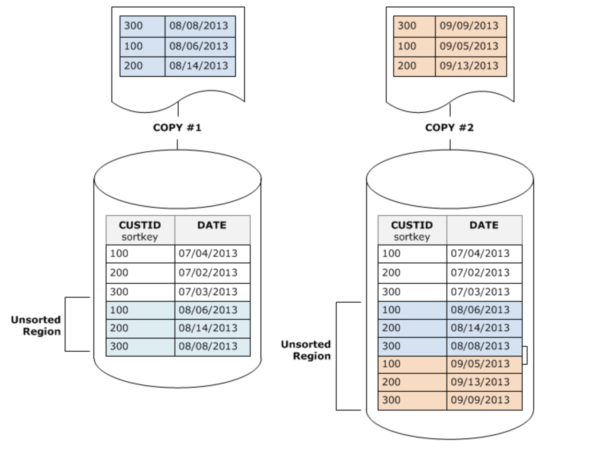

# Lab 8 - Stored Procedures and Functions

Stored Procedures

You can define an Amazon Redshift stored procedure using the PostgreSQL procedural language PL/pgSQL to perform a set of SQL queries and logical operations. The procedure is stored in the database and is available for any user with sufficient privileges to run.

Unlike a user-defined function (UDF), a stored procedure can incorporate data definition language (DDL) and data manipulation language (DML) in addition to SELECT queries. A stored procedure doesn't need to return a value. You can use procedural language, including looping and conditional expressions, to control logical flow.

In this lab, we will create stored procedure to perform deep copy.

A deep copy recreates and repopulates a table by using a bulk insert, which automatically sorts the table. If a table has a large unsorted region, a deep copy is much faster than a vacuum.

Before creating stored procedure in SQL Workbench editor, we need to define an alternate delimiter such as a forward slash (/). In SQL Workbench, go to File-->connect window and for Redshift connection specify Alternate delimiter as /

````
CREATE OR REPLACE PROCEDURE deep_copy(source_tab IN varchar(256))
AS $$
BEGIN
  EXECUTE 'create temp table ' ||source_tab||'_temp as select * from '|| source_tab;
  EXECUTE 'truncate '||source_tab;
  EXECUTE 'insert into '|| source_tab || ' (select * from '|| source_tab||'_temp)' ;
  EXECUTE 'drop table '||source_tab||'_temp';
  END;
$$ LANGUAGE plpgsql;
/

````

Let's run copy command on Orders table to append data. Input data is sorted within single load but since we are inserting same data again, data across loads is no longer sorted in table.


````
copy orders from 's3://redshift-immersionday-labs/data/orders/orders.tbl.'
iam_role 'arn:aws:iam::[Your-AWS_Account_Id]:role/[Your-Redshift-Role]'
region 'us-west-2' lzop delimiter '|' COMPUPDATE PRESET;
````
To check tables with higher unsorted data, execute following query
````
SELECT * FROM svv_table_info where unsorted > 10
````
we can run "Vacuum sort only orders" to resort the data but deep copy often faster than VACUUM. Let's execute stored procedure

````
call deep_copy('orders');
````

User-Defined Functions

You can create a custom user-defined scalar function (UDF) using either a SQL SELECT clause or a Python program. The new function is stored in the database and is available for any user with sufficient privileges to run, in much the same way as you run existing Amazon Redshift functions.

For Python UDFs, in addition to using the standard Python functionality, you can import your own custom Python modules.

A scalar SQL UDF incorporates a SQL SELECT clause that executes when the function is called and returns a single value.

````
create function f_sql_greater (float, float)
  returns float
stable
as $$
  select case when $1 > $2 then $1
    else $2
  end
$$ language sql;
/
````


````
select f_sql_greater(l_discount,l_tax) from lineitem limit 10;
````
Creating a Scalar Python UDF
A scalar Python UDF incorporates a Python program that executes when the function is called and returns a single value

````
create function f_py_greater (a float, b float)
  returns float
stable
as $$
  if a > b:
    return a
  return b
$$ language plpythonu;
/
````
````
select f_py_greater(l_discount,l_tax) from lineitem limit 10;
````
